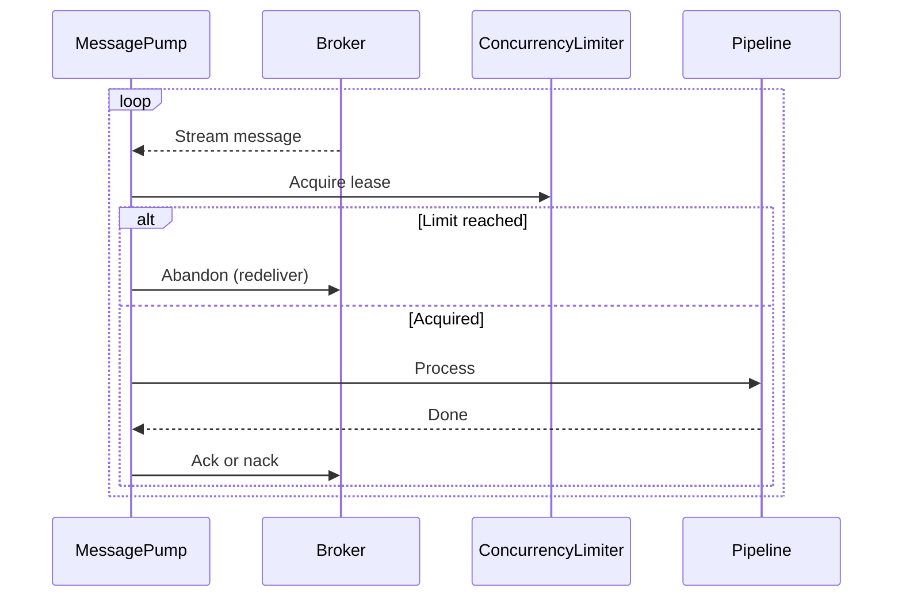
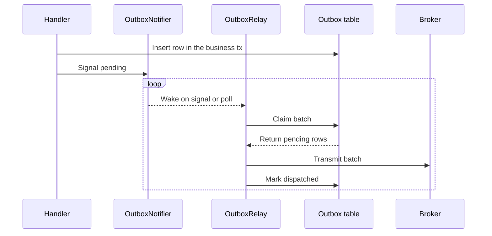
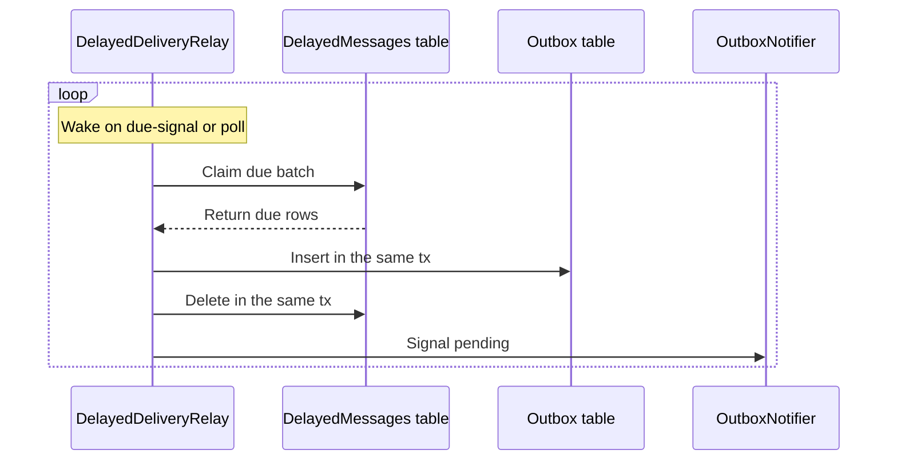
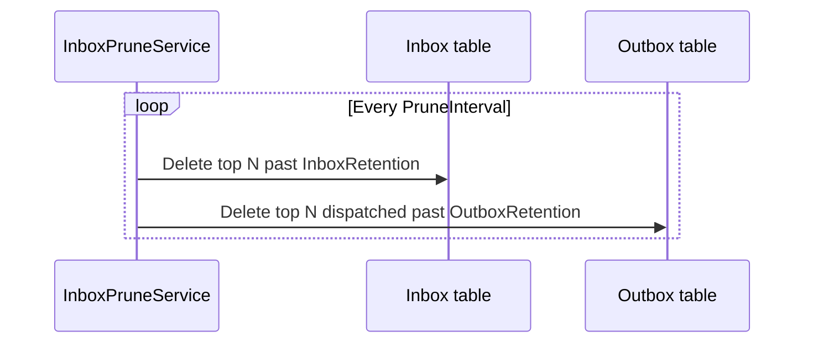
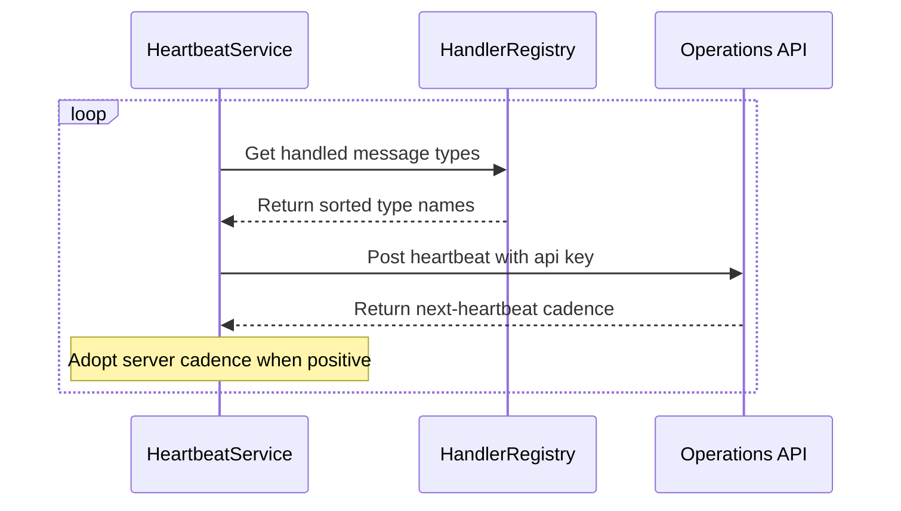
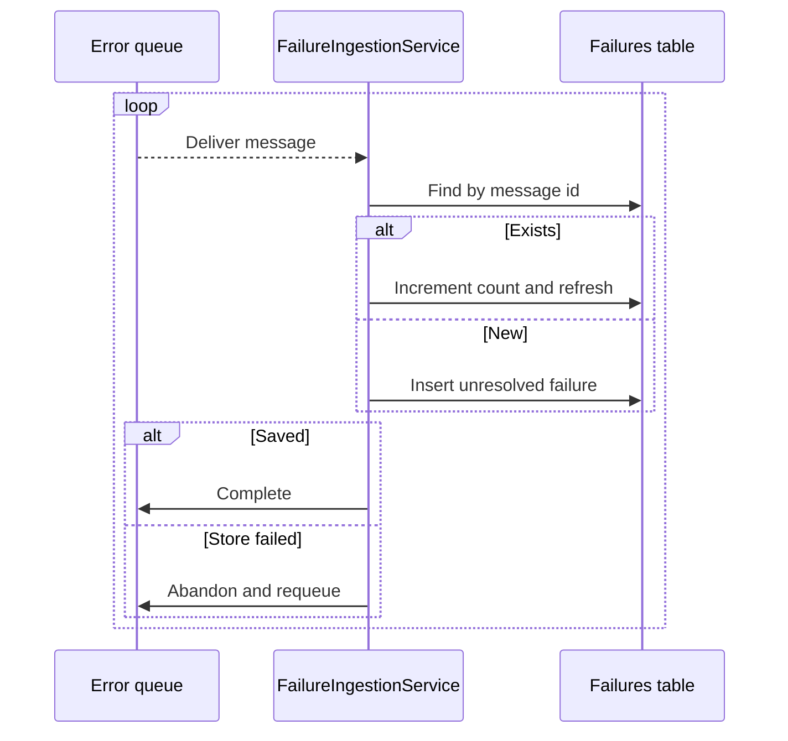
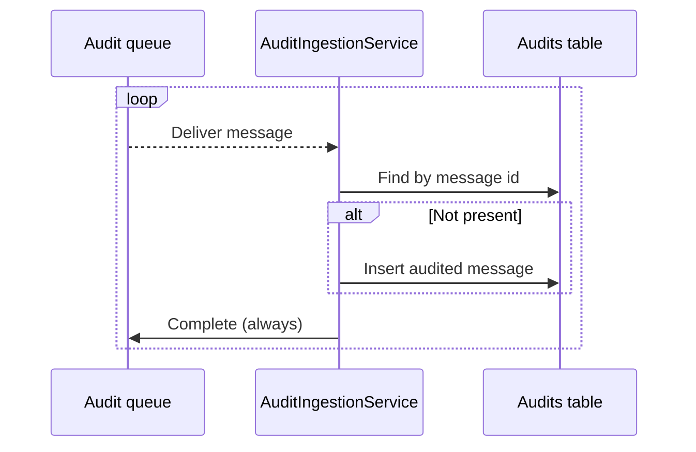
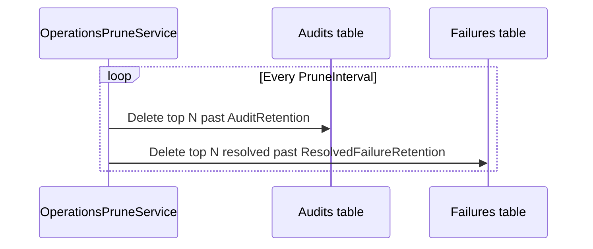

# Background jobs

Every long-running loop in the library is an `IHostedService`.
Endpoints run their own set.
Operations runs another.
Each one is registered by an explicit builder call so a host runs only what it opts into.

## Endpoint jobs

### MessagePump

Pulls from the endpoint queue and hands each message to the incoming pipeline.

- Runs once at startup, lives for the process lifetime.
- Streams from `IMessageTransport.CreateReceiverAsync` for the endpoint's queue.
- Concurrency is capped by `Parallel.ForEachAsync` with `MaxDegreeOfParallelism = Receiver.MaxConcurrentMessages`.
- Registered implicitly by `.WithMessageHandlers(...)` / `.WithMessageHandlersFromAssembly(...)` — an endpoint with no handlers only sends.

Touches:

- The endpoint queue (`MessagingOptions.EndpointName`).
- The full incoming pipeline (inbox dedup, handler dispatch, outbox write, retries).

Config knobs:

```csharp
.WithReceiver(receiver => receiver
    // Endpoint-wide in-flight ceiling, enforced by the pump.
    .WithMaxConcurrentMessages(10)
    // Transport client-side buffer.
    .WithPrefetchCount(50))
```



### OutboxRelay

Moves outbox rows onto the transport.

- Signal-driven, with a polling fallback.
- A send calls `IOutboxNotifier.NotifyPending()` inside the same transaction that inserted the row.
- The relay wakes on that signal; polling only catches signals lost to a crash or writes by another instance.
- A full batch loops immediately so a backlog drains at transport speed.
- Registered by `.WithOutboxRelay()`.

Touches:

- The `Outbox` table (`ClaimAsync` / `MarkDispatchedAsync`).
- The transport, via `OutboundDispatchPipeline`.

Config knobs:

```csharp
.WithOutboxRelay(outbox => outbox
    // Maximum rows claimed and transmitted per pass.
    .WithBatchSize(200)
    // Fallback poll cadence.
    .WithPollingInterval(TimeSpan.FromSeconds(5))
    // Must exceed worst-case transmit — a slow batch inside the timeout is not stolen.
    .WithClaimTimeout(TimeSpan.FromMinutes(1)))
```

Duplicates on the wire are expected by construction: transmit can succeed and `MarkDispatchedAsync` can fail, so the consumer's inbox is what closes the loop to exactly-once.



### DelayedDeliveryRelay

Promotes due delayed messages into the outbox.

- Signal-driven, with a polling fallback.
- A scheduled send inside `InMemoryTriggerWindow` sets an in-process timer that wakes the relay near its due time.
- The `DelayedMessages` row stays authoritative: on restart the timer is gone and the poll picks it up.
- Never transmits — a due message becomes an ordinary outbox row and the outbox relay does the send.
- Registered by `.WithDelayedDeliveryRelay()`.

Touches:

- The `DelayedMessages` table (`ClaimDueAsync` / `DeleteAsync`).
- The `Outbox` table (`AddAsync`) in the same transaction.
- Signals `IOutboxNotifier` after commit so the outbox relay picks up the promotions immediately.

Config knobs:

```csharp
.WithDelayedDeliveryRelay(delayed => delayed
    // Fallback poll cadence.
    .WithPollingInterval(TimeSpan.FromSeconds(30))
    // Maximum rows promoted per pass.
    .WithBatchSize(100)
    // Window inside which an in-process timer supplements the poll.
    .WithInMemoryTriggerWindow(TimeSpan.FromSeconds(60))
    // Optional: hand short delays to the broker where supported. Ceiling required.
    .WithTransportDelayWhenAvailable(TimeSpan.FromMinutes(15)))
```



### InboxPruneService

Deletes processed inbox rows and dispatched outbox rows past retention.

- Fixed-interval loop on `PruneInterval`.
- One scope per pass, one delete per table.
- Errors are logged and retried on the next tick — falling behind costs disk, not messages.
- Registered by `.WithEntityFrameworkCorePersistence<TDbContext>()`.

Touches:

- The `Inbox` table (`ProcessedAt < now - InboxRetention`).
- The `Outbox` table (`IsDispatched AND DispatchedAt < now - OutboxRetention`).

Config knobs:

```csharp
.WithEntityFrameworkCorePersistence<OrdersDbContext>(efCore => efCore
    // How long a processed message id is remembered for dedup.
    .WithInboxRetention(TimeSpan.FromDays(7))
    // How long a dispatched outbox row is kept before deletion.
    .WithOutboxRetention(TimeSpan.FromDays(1))
    // Prune loop cadence.
    .WithPruneInterval(TimeSpan.FromHours(1)))
```

`PruneBatchSize` (default 1000) caps rows deleted per table per pass.



### HeartbeatService

Reports this endpoint instance to Operations over HTTP.

- Fixed-interval loop, cadence echoed back by Operations.
- Deliberately HTTP, not broker: a heartbeat over the broker cannot report a broker outage.
- Failure is logged at debug and never fatal — an Operations outage must not affect the endpoint.
- Registered by `.WithOperationsReporting(...)`.

Touches:

- The Operations HTTP endpoint `POST api/heartbeats`.
- Named `HttpClient` `messagebus-operations`, 5-second timeout.
- `X-Operations-Key` header carries the endpoint API key.

Instance identity:

- `OperationsClientOptions.InstanceId` if set.
- Otherwise `Environment.MachineName` (container id in Docker, pod name in Kubernetes).
- Falls back to a random 12-char guid slice.

Config knobs:

```csharp
.WithOperationsReporting(operations => operations
    .WithBaseAddress("https://operations.internal")
    .WithApiKey(endpointApiKey))
```

`OperationsClientOptions.Interval` (default 30s) is the starting cadence; a `HeartbeatResponse.NextHeartbeatAfter` from Operations overrides it live.



## Operations jobs

### FailureIngestionService

Drains the shared error queue into the `Failures` table.

- Streams from the error queue for the process lifetime.
- One row per failed message id: redeliveries increment `FailureCount` and refresh `LastFailedAt`.
- A row that cannot be stored is abandoned back to the queue — an ingestion outage must not lose failures.
- Registered by `AddMessagingOperations(...)`.

Touches:

- The shared error queue (`OperationsOptions.ErrorQueueName`, default `messagebus-error`).
- `OperationsDbContext.Failures`.

Config knobs:

```csharp
builder.Services.AddMessagingOperations(operations => operations
    .WithErrorQueueName("messagebus-error"));
```

`IngestionPrefetchCount` (default 50) is the transport client-side buffer.



### AuditIngestionService

Drains the shared audit queue into the `Audits` table.

- Streams from the audit queue for the process lifetime.
- Off by default; on only when `OperationsOptions.IngestAudits` is true.
- One row per message id — a redelivered audit is a no-op.
- A row that cannot be stored is acknowledged anyway: audits are convenience data and a backed-up queue costs the broker more than the loss.
- Registered by `AddMessagingOperations(...)` when `IngestAudits` is on.

Touches:

- The shared audit queue (`OperationsOptions.AuditQueueName`, default `messagebus-audit`).
- `OperationsDbContext.Audits`.

Config knobs:

```csharp
builder.Services.AddMessagingOperations(operations => operations
    // Turns IngestAudits on and sets the queue name.
    .WithAuditQueueName("messagebus-audit"));
```



### OperationsPruneService

Prunes old audits and resolved failures from Operations' own storage.

- Fixed-interval loop on `OperationsOptions.PruneInterval`.
- Audits age out in days — they grow with throughput.
- Resolved failures last far longer — they answer questions asked months later.
- **Unresolved failures are never pruned.**
- Registered by `AddMessagingOperations(...)`.

Touches:

- `OperationsDbContext.Audits` (`ProcessedAt < now - AuditRetention`).
- `OperationsDbContext.Failures` (`Status != Unresolved AND ResolvedAt < now - ResolvedFailureRetention`).

Config knobs:

```csharp
builder.Services.AddMessagingOperations(operations => operations
    // Days rather than months. Grows with throughput.
    .WithAuditRetention(TimeSpan.FromDays(7)));
```

`ResolvedFailureRetention` (default 90 days), `PruneInterval` (default 1h) and `PruneBatchSize` (default 1000) are direct property setters on `OperationsOptions`.


