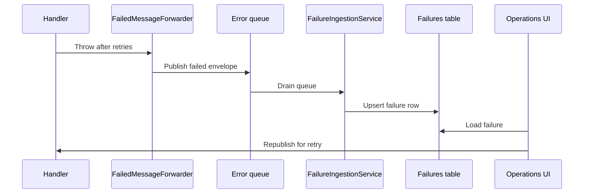

# Error and audit queues

Two shared queues.
Opt-in per endpoint.
Drained by the Operations service.

## End-to-end flow



## Error queue

```csharp
.WithErrorQueue(error => error.WithQueueName("messagebus-error"))
```

`FailedMessageForwarder` publishes a copy of the failed envelope with extra headers:

- `original-message-id` — id of the message this copy describes.
- `exception-type`
- `exception-message`
- `stack-trace`
- `failed-at` (UTC, ISO-8601)
- `delivery-attempt`
- `processed-by`

The copy carries its own `message-id` and `message-intent: command`.
Every other original header is preserved on the copy.
A retry from the Operations UI republishes the original body byte-for-byte under the original message id.

## Audit queue

```csharp
.WithAuditQueue(audit => audit
    .WithQueueName("messagebus-audit")
    .Enabled(builder.Environment.IsProduction()))
```

`AuditBehavior` writes a copy of every processed message in the handler's own transaction.
Cannot disagree with what committed.
Off by default — it doubles broker traffic.

Extra headers on the audit copy:

- `original-message-id` — id of the message this copy describes.
- `outcome: processed`
- `received-at`
- `duration-ms`
- `delivery-attempt`
- `processed-by`

The copy carries its own `message-id` and `message-intent: command`.

## Ingestion

`MessageBus.Operations` runs `FailureIngestionService` + `AuditIngestionService`.
Both pull from the shared queues and write the rows the Operations UI reads.

```csharp
builder.Services.AddMessagingOperations(operations => operations
    .WithErrorQueueName("messagebus-error")
    .WithAuditQueueName("messagebus-audit"));
```

The queues are shared across every endpoint.
`processed-by` identifies the producer.
