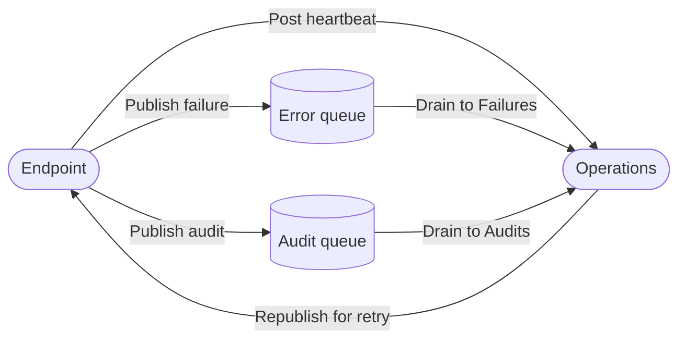

# Operations

Separate deployable that watches every endpoint and acts on failures.

## Architecture



- Heartbeats go over HTTP. A broker-based heartbeat cannot tell you the broker is down.
- Failures and audits go by queue. The message is already in the broker; a copy costs nothing.
- Retries republish directly. That works while the endpoint that failed the message is still down.
- Price: Operations needs broker credentials and one transport implementation.

## Endpoint side (client)

```csharp
.WithOperationsReporting(operations => operations
    .WithBaseAddress(builder.Configuration["Operations:BaseAddress"]!)
    .WithApiKey(builder.Configuration["Operations:ApiKey"]!))
```

Instance id defaults to `Environment.MachineName` (container id in Docker / pod name in Kubernetes).
Same pod restart → same `Instances` row.
Override via `Messaging:Operations:InstanceId` config if the platform doesn't give a stable name.

## Operations side (backend)

```csharp
builder.Services.AddRabbitMqTransport(rabbitMq => rabbitMq.WithConnectionString(connectionString));
builder.Services.AddMessagingOperations(operations => operations
    .WithErrorQueueName("messagebus-error")
    .WithAuditQueueName("messagebus-audit"));
```

## UI pages

| Page | Shows |
| --- | --- |
| `/Endpoints` | endpoints, live instances, health, endpoint / health filters |
| `/Keys` | endpoint api keys — create, rotate, disable |
| `/Errors` | filter, group, page, bulk retry / bulk delete |
| `/Errors/Details/{id}` | headers, body, stack trace, edit-and-retry, delete, embedded flow sequence |
| `/Audits` | processed messages, filters, groups |
| `/Audits/Details/{id}` | headers, body, embedded flow sequence |

The flow sequence renders inline on the Details pages as a `FlowSequence` view component.
Every message of one correlation id, causally ordered, across endpoints.

## Design rules

- **Operations holds no contracts.** Failures are raw transport messages: headers read, body opaque. Retry republishes byte-for-byte. Never versions against contract packages.
- **Registration is the api key.** Creating one declares an endpoint expected. That is what makes silence alertable.
- **One entry per failed message, not per attempt.** Repeats update a count and a last-failed time.
- **Editing fabricates a new message** with the original's correlation and a pointer back. The original stays exactly as it failed.
- **The flow view is why this exists.** Everything else is obtainable elsewhere with enough effort.

Out of scope: metrics and latency percentiles (OpenTelemetry does it better), log search, live queue browsing, configuration editing.

## Deploy

See [deployment.md](deployment.md).
Dockerfile ships alongside the project at `src/MessageBus.Operations.Web/Dockerfile`.
