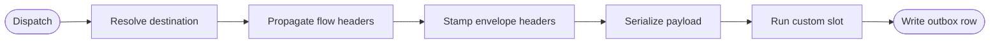
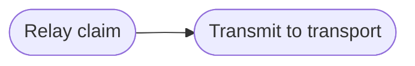

# Pipeline and behaviors

Fixed stages in each direction, one custom slot per direction, split contexts.

## Stage order

Incoming — physical stage runs before the resolver, logical after.

```mermaid
flowchart LR
    Broker([Broker]) --> Log[Log incoming]
    Log --> Trace[Open trace span]
    Trace --> Settle[Register settlement]
    Settle --> Resolve[Resolve CLR type]
    Resolve --> Retry[Wrap in retry]
    Retry --> Context[Bind message context]
    Context --> Timeout[Apply handler timeout]
    Timeout --> Tx[Open transaction]
    Tx --> Dedup[Check inbox]
    Dedup --> Audit[Copy to audit queue]
    Audit --> Custom[Run custom slot]
    Custom --> Handler([Invoke handler])
```



Outgoing — everything a send touches on the way to the outbox row.



Outbound dispatch — relay picks a claimed row and sends.



## The three contexts

| Context | Interface | What it carries |
| --- | --- | --- |
| Physical incoming | `IIncomingPhysicalContext` | headers, payload bytes, settlement |
| Logical incoming | `IIncomingLogicalContext` | + resolved CLR type, deserialized message, attempt state |
| Outbound dispatch | `OutboundDispatchContext` | stored message on its way to the transport |

Physical runs before the type resolver.
Logical runs after.
The resolver is the handoff.

## Built-in positions are fixed

Retry outside the transaction.
Dedup inside it.
Logging outermost.
Outbox innermost.
Each position is load-bearing.
A builder over them turns every position into an opportunity to lose messages.

## Custom behavior

```csharp
.WithIncomingBehavior<ValidationBehavior>()
.WithOutgoingBehavior<TenantHeaderBehavior>()
```

```csharp
internal sealed class ValidationBehavior(IValidator validator) : IIncomingBehavior<IIncomingLogicalContext>
{
    public async Task InvokeAsync(IIncomingLogicalContext context, Func<Task> next)
    {
        var problems = validator.Validate(context.Message);
        if (problems.Count > 0)
        {
            throw new ValidationException(problems);
        }

        await next();
    }
}
```

- Custom incoming behaviors run inside the transaction and after dedup.
- Their work commits or rolls back with the handler's.
- Built-ins are singletons and reach scoped services via `context.Services`.
- Custom behaviors stay scoped and keep constructor injection.
- Multiple customs run in registration order.
