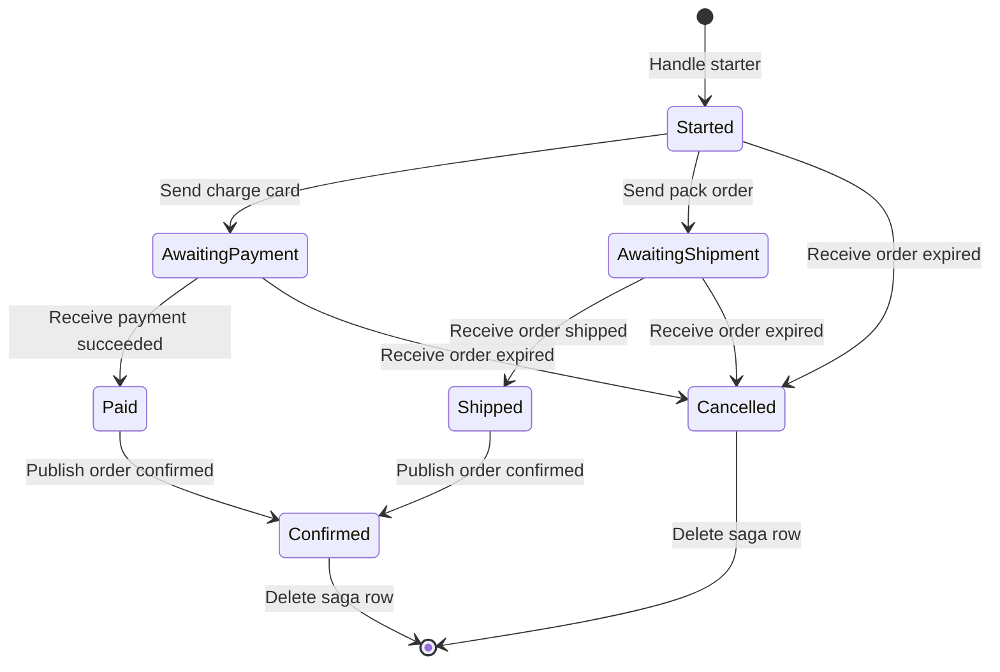

# Sagas

State + correlation + completion.
Created by starter messages, deleted when completed.

## Lifecycle

Row exists between the starter and completion.
Every other correlated message updates state until one path marks it complete.



## A three-step conversation

Order pays and ships in parallel.
Saga completes when both arrive, times out after two hours if either does not.

```csharp
public sealed class OrderFulfilmentState : SagaState
{
    public string CustomerId { get; set; } = string.Empty;
    public decimal Total { get; set; }
    public bool IsPaid { get; set; }
    public bool IsShipped { get; set; }
}
```

```csharp
public sealed class OrderFulfilmentSaga(TimeProvider timeProvider, ILogger<OrderFulfilmentSaga> logger)
    : Saga<OrderFulfilmentState>,
      ISagaStarter<OrderPlaced>,
      IMessageHandler<PaymentSucceeded>,
      IMessageHandler<OrderShipped>,
      IMessageHandler<OrderExpired>
{
    protected override string Correlate(IMessage message) => message switch
    {
        OrderPlaced placed => placed.OrderId,
        PaymentSucceeded paid => paid.OrderId,
        OrderShipped shipped => shipped.OrderId,
        OrderExpired expired => expired.OrderId,
        _ => throw new NotSupportedException($"No correlation for {message.GetType().Name}.")
    };

    // Starter — the saga row is created when this handler runs.
    public async Task HandleAsync(OrderPlaced message, IMessageContext messageContext)
    {
        State.CustomerId = message.CustomerId;
        State.Total = message.Total;

        // Kick off the two parallel work streams.
        await messageContext.SendAsync(new ChargeCard
        {
            OrderId = message.OrderId,
            CustomerId = message.CustomerId,
            Amount = message.Total
        });
        await messageContext.SendAsync(new PackOrder
        {
            OrderId = message.OrderId
        });

        // Timer as a delayed local message. Fires if the saga has not completed by then.
        await messageContext.SendLocalAsync(new ExpireOrder
        {
            OrderId = message.OrderId
        }, new SendOptions().DeliverNoSoonerThan(timeProvider.GetUtcNow().AddHours(2)));
    }

    public async Task HandleAsync(PaymentSucceeded message, IMessageContext messageContext)
    {
        State.IsPaid = true;
        await TryCompleteAsync(messageContext);
    }

    public async Task HandleAsync(OrderShipped message, IMessageContext messageContext)
    {
        State.IsShipped = true;
        await TryCompleteAsync(messageContext);
    }

    public async Task HandleAsync(OrderExpired message, IMessageContext messageContext)
    {
        // Late — the promises were not met in time.
        logger.LogWarning(
            "Order {OrderId} expired. Paid: {IsPaid}, Shipped: {IsShipped}.",
            State.CorrelationId, State.IsPaid, State.IsShipped);

        await messageContext.PublishAsync(new OrderCancelled
        {
            OrderId = State.CorrelationId,
            Reason = "Timed out waiting for payment or shipment."
        });

        MarkAsCompleted();
    }

    private async Task TryCompleteAsync(IMessageContext messageContext)
    {
        if (!State.IsPaid || !State.IsShipped)
        {
            return;
        }

        await messageContext.PublishAsync(new OrderConfirmed
        {
            OrderId = State.CorrelationId,
            CustomerId = State.CustomerId,
            Total = State.Total
        });

        MarkAsCompleted();
    }
}
```

## Rules

- Unique index on `(SagaTypeName, CorrelationId)` stops two starters creating two sagas for one correlation.
- A row version turns a concurrent update into a retry against fresh state.
- `CorrelationId` on `SagaState` is a business key — the order id.
- `correlation-id` on a header is a flow id. Similar names, different jobs.
- Timeouts are ordinary delayed messages. See [sending & handling](sending-and-handling.md#delayed-delivery).
- `MarkAsCompleted()` deletes the saga row at the end of the handler.
- A late message correlated to a completed saga does nothing — the row is gone.

## Storage

All sagas share one table (default name `Sagas`).
One row per correlated instance.
For the full schema — every messaging table alongside this one — see [storage-tables.md](storage-tables.md).

| Column | Meaning |
| --- | --- |
| `SagaId` | Guid primary key. |
| `SagaTypeName` | Discriminator. See [type name](#type-name). |
| `CorrelationId` | Business key returned by `Correlate`. |
| `State` | JSON blob of the derived `SagaState`. |
| `Version` | Nullable `byte[]`. Becomes a `rowversion` when [concurrency](#concurrency) is on. |

State is serialized by a dedicated `System.Text.Json` serializer, not the wire message serializer.
Camel-cased on write, case-insensitive on read.
State is private storage — cross-version tolerance is not a design goal.

## Concurrency

Two guards, one per write path.

### On insert — unique index

Every saga row has a unique index on `(SagaTypeName, CorrelationId)`.  
Two starters racing for the same correlation both try to `INSERT`.  
The second one throws a `DbUpdateException` for the unique-constraint violation.

Always on. No configuration. The unique index is always there.

The exception propagates up through the handler.  
`TransactionBehavior` rolls back.`RetryBehavior` reschedules the message.  
On the next attempt the row exists. `FindAsync` returns it.  
The handler runs again against the winner's state and saves as an update.  

Effect: two concurrent starters cost one wasted retry.  
Both messages end up handled against the same saga row.

### On update — optional rowversion

**Optimistic concurrency is off by default.**
Turn it on whenever your EF Core provider supports `rowversion`.  
SQL Server always. Other providers need a converter.

```csharp
modelBuilder.ApplyMessagingModel(model => model.WithOptimisticConcurrencyForSagas());
```

With it on, the `Version` column is mapped as `rowversion`.  
Two messages for one correlation arrive at once.  
The second commit throws `DbUpdateConcurrencyException`.  
The pipeline retries against fresh state.  
The second write does not silently clobber the first.  

Without it, last-write-wins. Two concurrent handlers each read the same state.  
Each writes its update. Only the last one's changes survive.  
Fine for a single-writer saga. Catastrophic for anything else.

### Why off by default

Provider portability, not a recommendation about environments. 
`IsRowVersion()` maps cleanly on SQL Server via the native `rowversion` type.  
Other providers do not. Postgres uses `xmin`. MySQL has no direct equivalent.  
SQLite lacks the type entirely.  
Defaulting to on would break the first-time-run on any provider that does not translate `IsRowVersion()`.

The `Version` column is always mapped as nullable `byte[]` whether concurrency is on or off.  
Turning it on later is a config change. No migration needed.

The choice is per-provider, not per-environment.  
Set it once at model-build time based on the provider the endpoint targets.  
Do not toggle it between dev and prod against the same provider.  
That is how sagas silently corrupt in one environment and pass tests in another.

## Type name

Persisted as `SagaTypeName`.  
Default: the saga class's `Type.FullName` (namespace + class name, no assembly, no version).

**A rename or a move breaks correlation** — existing rows still hold the old name and become orphaned.  
New invocations look up the new name and find nothing, so every message looks like a starter (or is dropped for non-starters).

Pin the name with `[SagaName]`:

```csharp
[SagaName("Orders.OrderFulfilmentSaga.v1")]
public sealed class OrderFulfilmentSaga(...) : Saga<OrderFulfilmentState>, ...
```

- The attribute is what makes rename/move safe.
- When pinning a saga that already has persisted rows, use its literal `Type.FullName` so those rows stay addressable.
- Same pattern as `[MessageName]` on contracts.
