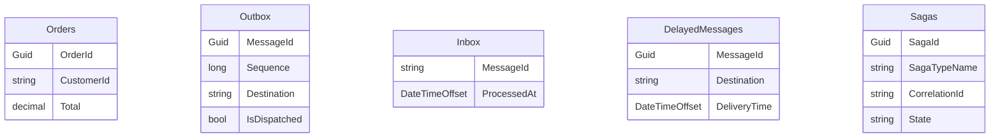
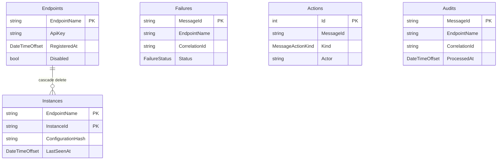

# Storage tables

Every table the library shapes onto a database.
Four are the endpoint's, in the host's own `DbContext`.
Five are Operations', in Operations' own database.

## Endpoint tables (`ApplyMessagingModel`)

Shape them onto the host's `DbContext`:

```csharp
public sealed class OrdersDbContext(DbContextOptions<OrdersDbContext> options) : DbContext(options)
{
    public DbSet<Order> Orders => Set<Order>();

    protected override void OnModelCreating(ModelBuilder modelBuilder)
    {
        base.OnModelCreating(modelBuilder);

        // Adds Outbox, Inbox, DelayedMessages, Sagas in the "Messaging" schema.
        modelBuilder.ApplyMessagingModel();
    }
}
```

Default schema is `Messaging`.
Table names default to `Outbox`, `Inbox`, `DelayedMessages`, `Sagas` and each is overridable through `MessagingModelOptions`.
The four are independent — no foreign keys between them, and no foreign keys to the host's business tables.
They live in the same database as the business tables so a handler can write both in one `SaveChangesAsync`.



The messaging four are one cluster next to the host's business tables.
No arrows: they do not reference each other, and they do not reference `Orders`.
The join to a business row is logical (through `CorrelationId`), not enforced.

### Outbox

Outgoing messages waiting for a relay.
See [persistence & outbox](persistence-and-outbox.md) for the relay contract.

| Column | Type | Notes |
| --- | --- | --- |
| `MessageId` | `Guid` | Primary key. |
| `Sequence` | `long` | Database-generated on add. Gives ordering the Guid key does not. |
| `MessageTypeName` | `string(500)` | Required. Wire name of the contract. |
| `Destination` | `string(500)` | Required. Queue or topic the relay dispatches to. |
| `Payload` | `string` | Required. Bounded by `MessagingModelOptions.MaxPayloadLength` when set. |
| `Headers` | `string` | Required. JSON blob. Bounded by `MaxPayloadLength`. |
| `CreatedAt` | `DateTimeOffset` | When the row was written. |
| `ClaimedUntil` | `DateTimeOffset?` | Nullable. Past or null means free — a crashed relay's batch returns without a detector. |
| `ClaimId` | `Guid?` | Nullable. Identifies the claiming pass so a relay reads back exactly its rows. |
| `IsDispatched` | `bool` | True once the transport accepted it. |
| `DispatchedAt` | `DateTimeOffset?` | Nullable. Set when `IsDispatched` flips true. Read by the prune. |

Indexes:

- `IX_Outbox_Pending` on `(IsDispatched, ClaimedUntil, Sequence)` — the relay's only query.
- `IX_Outbox_ClaimId` on `ClaimId` — reads a claimed batch back by id.

Retention:
Dispatched rows are deleted by the prune once `DispatchedAt` is older than `OutboxRetention` (default 1 day).
Undispatched rows never age out — losing one would lose a message.

### Inbox

One row per message this endpoint has processed.
The primary key is the deduplication key.

| Column | Type | Notes |
| --- | --- | --- |
| `MessageId` | `string(200)` | Primary key. Insert-or-fail is the whole mechanism. |
| `ProcessedAt` | `DateTimeOffset` | When the message was processed. Read by the prune. |

Indexes:

- `IX_Inbox_ProcessedAt` on `ProcessedAt` — the prune's only query.

Retention:
Rows older than `InboxRetention` (default 7 days) are deleted by the prune.
Set it longer than the broker's longest possible redelivery window or deduplication stops working.

### DelayedMessages

Messages waiting for their delivery time.
Timeouts and `DeliverNoSoonerThan` sends land here.

| Column | Type | Notes |
| --- | --- | --- |
| `MessageId` | `Guid` | Primary key. Deleting the row cancels the delivery. |
| `MessageTypeName` | `string(500)` | Required. Wire name. |
| `Destination` | `string(500)` | Required. Queue or topic the delayed relay dispatches to. |
| `Payload` | `string` | Required. Bounded by `MaxPayloadLength`. |
| `Headers` | `string` | Required. JSON blob. Bounded by `MaxPayloadLength`. |
| `DeliveryTime` | `DateTimeOffset` | When the delayed relay will send it. |

Indexes:

- `IX_DelayedMessages_DeliveryTime` on `DeliveryTime` — the relay's due-time query.

Retention:
No prune.
A row lives until the delayed relay dispatches it, or until a completing saga deletes its own timeout.

### Sagas

One row per correlated saga instance.
See [sagas](sagas.md) for the handler side.

| Column | Type | Notes |
| --- | --- | --- |
| `SagaId` | `Guid` | Primary key. |
| `SagaTypeName` | `string(500)` | Required. Discriminator — see [sagas: type name](sagas.md#type-name). |
| `CorrelationId` | `string(500)` | Required. Business key returned by `Correlate`. |
| `State` | `string` | Required. JSON blob of the derived `SagaState`. Bounded by `MaxPayloadLength`. |
| `Version` | `byte[]` | `rowversion` when `UseOptimisticConcurrencyForSagas` is on (off by default). Nullable otherwise; the column exists either way so turning concurrency on later is a config change, not a migration. |

Indexes:

- `IX_Sagas_Correlation` on `(SagaTypeName, CorrelationId)`, unique — two rows for one key would silently start a second saga.

Retention:
No prune.
`MarkAsCompleted()` deletes the row at the end of the handler.
A late message correlated to a completed saga does nothing — the row is gone.

## Operations tables (`OperationsDbContext`)

Owned by the Operations.Web deployable, in its own database.
No default schema override — tables live in the provider's default schema.
See [operations](operations.md) for the surrounding service.



`Endpoints → Instances` is the only enforced relationship (cascade delete).
`Failures` and `Audits` are independent lists — no foreign key to `Endpoints`.
`Actions.MessageId` matches `Failures.MessageId` but has no foreign key: an action row survives the failure row it points at, so the join is logical, not enforced.

### Endpoints

Endpoints Operations expects to hear from.
Created by registering an API key.

| Column | Type | Notes |
| --- | --- | --- |
| `EndpointName` | `string(200)` | Primary key. Logical name. |
| `ApiKey` | `string(200)` | Required. Plaintext key presented on `/api/heartbeats`. |
| `RegisteredAt` | `DateTimeOffset` | When the registration was created. |
| `StaleAfter` | `TimeSpan` | Per-endpoint tolerance before silence reads as stale. Default 2 minutes. |
| `Disabled` | `bool` | Default `false`. A disabled endpoint's key is refused and it disappears from runtime views; the row is kept so history stays addressable. |

Indexes:

- `IX_Endpoints_ApiKey` on `ApiKey`, unique — identity comes from the key, and duplicates would let one endpoint claim another's name.

Retention:
No prune.

### Instances

One row per running process of each endpoint.

| Column | Type | Notes |
| --- | --- | --- |
| `EndpointName` | `string(200)` | Part of the composite primary key. FK to `Endpoints.EndpointName`, cascade delete. |
| `InstanceId` | `string(200)` | Part of the composite primary key. Per-process id. |
| `Version` | `string(100)` | Nullable. Deployed assembly version. |
| `MachineName` | `string(200)` | Nullable. Host or container name. |
| `HandledMessageTypes` | `string` | Required. Wire names this instance handles. |
| `ConfigurationHash` | `string(64)` | Required. Hash of the parts that should not vary between instances. |
| `LastSeenAt` | `DateTimeOffset` | When this instance last reported. |
| `OutboxPending` | `int` | Outbox rows waiting to dispatch at the last heartbeat. |
| `DelayedPending` | `int` | Delayed messages waiting at the last heartbeat. |
| `IsHealthy` | `bool` | Whether the endpoint's self-checks passed at the last heartbeat. |

Indexes:

- `IX_Instances_LastSeenAt` on `LastSeenAt` — the "who has gone quiet" query.

Retention:
No prune.
An instance row is removed when its parent `Endpoints` row is deleted (cascade).

### Failures

One row per failed message, aggregated across delivery attempts.
A bug that fails two hundred messages is two hundred rows.
A message that fails ten times is one row with `FailureCount = 10`.

| Column | Type | Notes |
| --- | --- | --- |
| `MessageId` | `string(200)` | Primary key. Id of the failed message, not of the error copy. |
| `EndpointName` | `string(200)` | Required. Where a retry is sent. No FK. |
| `SentBy` | `string(200)` | Nullable. Null for a message nothing in the estate produced. |
| `MessageTypeName` | `string(500)` | Required. Wire name. |
| `CorrelationId` | `string(200)` | Required. Flow id every message in the same conversation carries. |
| `CausationId` | `string(200)` | Nullable. Id of the message that caused this one. Null for a root. |
| `Payload` | `byte[]` | Required. Byte-for-byte — a retry has to republish what failed. |
| `Headers` | `string` | Required. JSON blob of the transport headers as they were. |
| `ExceptionType` | `string(500)` | Required. Full name of the exception. |
| `ExceptionMessage` | `string(2000)` | Required. Truncated to fit. |
| `StackTrace` | `string` | Nullable. |
| `FirstFailedAt` | `DateTimeOffset` | When the first failed delivery landed. |
| `LastFailedAt` | `DateTimeOffset` | When the most recent failed delivery landed. |
| `FailureCount` | `int` | Number of times this message has failed. |
| `Status` | `FailureStatus` | `Unresolved`, `Retried`, or `Discarded`. |
| `ResolvedBy` | `string(200)` | Nullable. Operator who resolved it. |
| `ResolutionReason` | `string(1000)` | Nullable. Reason given at resolution. |
| `ResolvedAt` | `DateTimeOffset?` | Nullable. When it was resolved. Read by the prune. |
| `EditedFromMessageId` | `string(200)` | Nullable. Set on the copy an edit produced, so an edit is traceable back. |

Indexes:

- `IX_Failures_StatusLastFailed` on `(Status, LastFailedAt)` — the list view: unresolved first, newest first.
- `IX_Failures_CorrelationId` on `CorrelationId` — a support ticket leads with a correlation id.
- `IX_Failures_Grouping` on `(ExceptionType, MessageTypeName)` — the group-by-cause view.

Retention:
Unresolved rows are never pruned — one that ages out unseen is a bug nobody learns about.
Resolved rows (`Retried` or `Discarded`) are deleted once `ResolvedAt` is older than `ResolvedFailureRetention` (default 90 days).

### Audits

One row per successfully processed message, when audit ingestion is on.
Optional and off by default — it grows with throughput.

| Column | Type | Notes |
| --- | --- | --- |
| `MessageId` | `string(200)` | Primary key. |
| `EndpointName` | `string(200)` | Required. The endpoint that processed it. No FK. |
| `SentBy` | `string(200)` | Nullable. |
| `MessageTypeName` | `string(500)` | Required. Wire name. |
| `CorrelationId` | `string(200)` | Required. |
| `CausationId` | `string(200)` | Nullable. |
| `Headers` | `string` | Required. JSON blob. |
| `Payload` | `byte[]` | Required. Original bytes as processed. |
| `ProcessedAt` | `DateTimeOffset` | When the message was processed. Read by the prune. |
| `DurationMilliseconds` | `double` | Handler time. |
| `DeliveryAttempt` | `int` | Broker delivery attempt on the successful processing. |

Indexes:

- `IX_Audits_CorrelationId` on `CorrelationId` — the flow view's join.
- `IX_Audits_ProcessedAt` on `ProcessedAt` — the prune's only query.

Retention:
Rows older than `AuditRetention` (default 7 days) are deleted by the prune.
Days rather than months: Operations' own storage must not become the largest in the system.

### Actions

Audit log of operator actions against failures.
Never a hard delete of the action itself: "what did we write off last quarter" is a real question.

| Column | Type | Notes |
| --- | --- | --- |
| `Id` | `int` | Primary key. Store-assigned identity. |
| `MessageId` | `string(200)` | Required. Id of the message the action was taken against. |
| `Kind` | `MessageActionKind` | Required. `Retry`, `ReturnToSource`, `Discard`, `EditAndRetry`, or `Delete`. |
| `Actor` | `string(200)` | Required. Operator who performed the action. |
| `Reason` | `string(1000)` | Nullable. Required for discards and edits at the application layer, optional in the schema. |
| `Destination` | `string(200)` | Nullable. Endpoint the message was sent to when the action dispatched one. |
| `PerformedAt` | `DateTimeOffset` | When the action was performed. |

Indexes:

- `IX_Actions_MessageId` on `MessageId` — the "what was done to this message" query.

Retention:
No prune.
An action survives the failure row it points at — `MessageActionKind.Delete` removes a failure but the action row explaining it stays.
